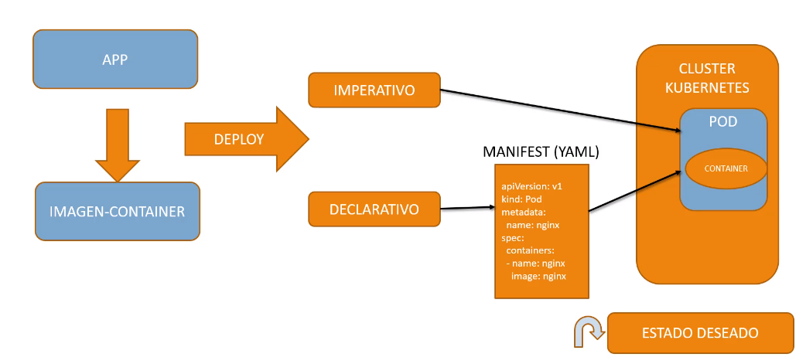
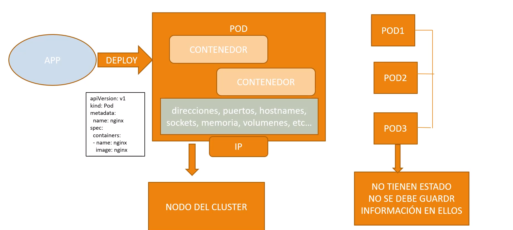
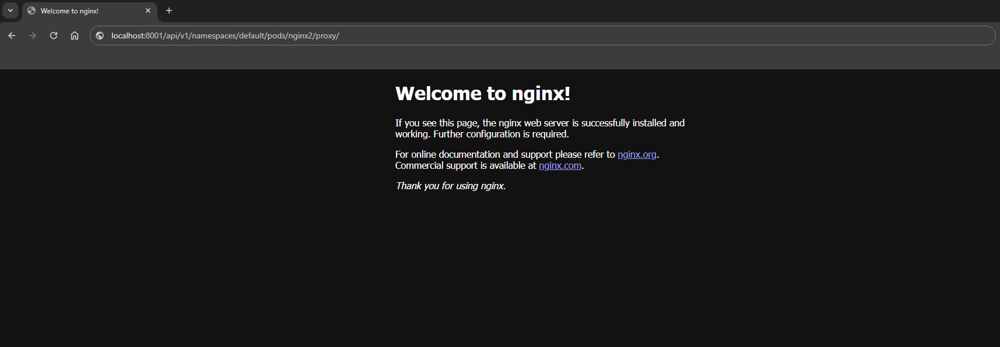
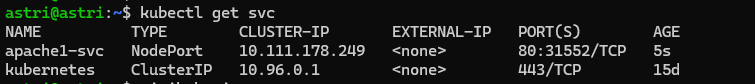

## Comandos Principales

```
kubectl version
```
```
kubectl version --output=yaml
```

#### Antes de comenzar, verifica el status de minikube

```
minikube status
```
```
minikube start
```

### Cliclo de Vida de un POD




#### Caracteristicas de una APP desplegada en un POD 
- una imagen se desplegara como contenedor dentro de un pod
- el POD asignara direccion , puertos, hostname, sockets, memoria
- el pod estara asosisdo a un cluster 
- otra caracteristica es que un pod se puede replicar
- los pod no tienen estado, NO se debe guardar informacion en ellos





#### Iniciar un POD

- Metodo imperativo ( comandos)
- Metodo Declarativo ( manifest yaml)

```
kubectl run nginx1 --image=nginx
```
```
kubectl run apache --image=httpd --port=8080
```

#### Obtener Informacion de pods que estan corriendo
- con la opcion ``` -o wide ```  obtenemos mas informacion 

```
kubectl get pods
```
```
kubectl get pods -o wide
```

- La opcion ``` describe ```  debe ser usada indicando el tipo de recurso ```pod/...```
- Se obtiene informacion como:
    - name
    - namespace ( default )
    - Volumes
    - IP 
```
kubectl describe pod/nginx
```

#### Comandos de ejecución sobre los PODS

- ejecutar el comando ``` ls ``` en contenedor nginx que tenemos corriendo
```
kubectl exec nginx -- ls
```

- ingresar al contenedor nginx en modo interactivo con la shell ( exit para salir)
```
kubectl exec nginx -it -- bash
```

- ejecutar  ``` -- uname -a ``` , para obtenere caracteristicas del contenedor  
```
kubectl exec nginx -- uname -a
```

```
kubectl run apache --image=httpd --port=8080
```

#### Obtener el log de un POD ( ejemplo pod ```apache```)
```
kubectl logs apache
```
- se mantiene en escucha del log
```
kubectl logs -f apache
```

- Usar TAIL para ver las ultimas lineas

```
kubectl logs apache --tail=30
```


#### **Proxy:**
- habilita un puerto por el cual se puede reguntar por las caracteristicas y estado de las Apps localhost:8001

```
kubectl proxy --address='0.0.0.0' --accept-hosts='^.*$'
```
- api general
    - http://localhost:8001/version

- Version
    - http://localhost:8001/version

- Healthz
    - http://localhost:8001/healthz
    return ok 

#### Acceder al pod a través de la API
- http://localhost:8001/api/v1/namespaces/default/pods/nginx2 
- se observa un json con toda la informacion del pod consultado

- http://10.31.193.170:8001/api/v1/namespaces/default/pods/nginx2/proxy/

- Se accede al servicio desplegado 





### probar el pod con un Servicio 


kubectl expose pod nginx --port=80 --name=ngingx-svc --type=NodePort


- check IP de minikube

```
minikube ip
```

- Ver los sevicios expuestos 
```
kubectl get svc
```


### Exponer un servicio 
```
kubectl expose pod apache --port=80 --name=apache1-svc --type=NodePort
```

- Usa la ip de minikube y el puerto entregado 

- ip:30552  


- otra forma de acceder a servicios web desplegados en un servidor, es mapear por ssh
- ``` 8080 ``` sera el puerto donde quiero que se despliegue en  mi pc local el servicio
- ```:192.168.49.2:31552 ``` seguido de la ip del servicio original y el puerto 
-  finalmmte la conexion al server de destino ``` user@IP ```

```
ssh -L 8080:192.168.49.2:31552 user@IP
```

#### Port forwarding 
- mapear un puerto local a remoto
- 9999 puerto local 
- 80 el puerto del pod

```
kubectl port-forward apache 9999:80
```


