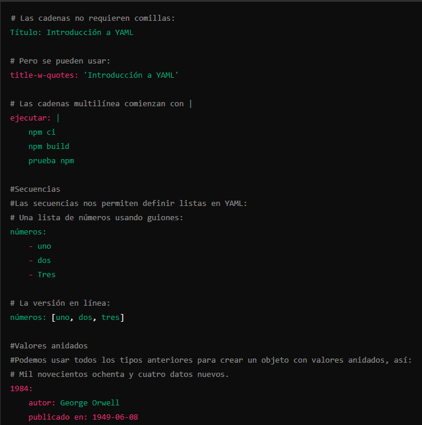

# Introduccion a archivos YAML y Manifest

## YAML

YAML (YAML Ain't Markup Language) es un formato de serialización de datos legible por humanos que se utiliza comúnmente para configuraciones y almacenamiento de datos estructurados.
En resumen, YAML es un formato de serialización de datos que se destaca por su legibilidad, facilidad de uso y flexibilidad, lo que lo hace adecuado para una amplia gama de aplicaciones, desde la configuración de aplicaciones hasta el intercambio de datos entre sistemas.

### Tips

- basado en comonentes clave:valor
- para hacer cadaena multilinea se puede usar ` | ` y luego identar con `espacios`
- permite lista de valores usando `-` o modo inline   `números: [uno, dos, tres]` 
- Usar anidados

### Ejemplo



## Manifest

### Primer fichero manifest .yaml

### 1. Dockerfile


```
##Descargamos UBUNTU
FROM ubuntu

##Actualizamos el sistema
RUN apt-get update

##En algunas versiones de Linux es necesario configurar una variable para el TIMEZONE
ENV TZ=Europe/Madrid

##Luego creamos un fichero llamado /etc/timezone para configurar 
RUN ln -snf /usr/share/zoneinfo/$TZ /etc/localtime && echo $TZ > /etc/timezone

##Instalamos NGINX
RUN apt-get install -y nginx

##Creamos un fichero index.html en el directorio por defecto de nginx
RUN echo 'Ejemplo de POD con KUBERNETES y YAML' > /var/www/html/index.html

##Arrancamos NGINX a través de ENTRYPOINT para que no pueda ser modificado en la creación del contenedor
ENTRYPOINT ["/usr/sbin/nginx", "-g", "daemon off;"]

##Exponemos el Puerto 80
EXPOSE 80
```

### 2. Crear la imagen de Docker

```
docker build -t nginx_web:v1 .
```

### 3. nginx.yaml


```
apiVersion: v1
kind: Pod
metadata:
  name: nginx
  labels:
    zone: prod
    version: v1
spec:
  containers:
   - name: nginx   
     image: nginx_web:v1
```

### 4. Iniciar el Pod nginx.yaml

```
 kubectl create -f nginx.yaml
```

- si es necesario borrar un pod anteriorr
```
kubectl delete pod/nginx1
```

### 5. Obtiene el estado con:

```
 kubectl get pod
```

```
 kubectl logs nginx
```

```
 kubectl describe nginx
```
```
 kubectl get pod/nginx -o yaml
```

```
 kubectl get pod/nginx -o yaml > nginx_status.yaml
```


### 6. Crear un servicio para validar el despliegue

```
 kubectl expose pod nginx --name=nginx-svc --port=80 --type=NodePort
```

kubectl get svc nginx-svc

minikube ip 

